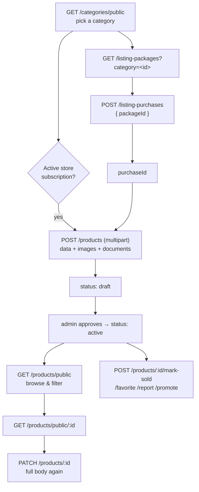

# Listing Forms API Documentation

Reference for building the listing screens against the per-category product API.

## Table of Contents

- [Overview](#overview)
- [What Changed — Read This First](#what-changed--read-this-first)
- [Conventions](#conventions)
- [The Listing Lifecycle](#the-listing-lifecycle)
- [Endpoint Reference](#endpoint-reference)
- [Uploading a Listing](#uploading-a-listing)
- [Fields Shared by Every Category](#fields-shared-by-every-category)
- [Server-Derived Fields — Never Send These](#server-derived-fields--never-send-these)
- [Brands and models](#brands-and-models)
- [Category Forms](#category-forms)
  - [Simple categories](#simple-categories--sellx-electronics-furniture-clothing-book-bike)
  - [Property](#property)
  - [Car](#car)
  - [Boat](#boat)
  - [Motorcycle](#motorcycle)
  - [Job](#job)
- [Option Value Reference](#option-value-reference)
- [TypeScript Constants](#typescript-constants)
- [Migration Checklist](#migration-checklist)
- [Errors](#errors)

---

## Overview

Each of the 11 categories has its own listing form. The server resolves the category from the
request, then validates the body against **that category's schema only**:

- Every field the spec marks *(Required)* is enforced. A missing one returns `400` naming it.
- Fields belonging to a different category are **stripped**, not stored — a book listing sent
  with `horsepower` is accepted, but `horsepower` will not be saved or returned.
- Five categories branch into variants chosen by a **discriminator field** the client must send.

Validation runs *before* a listing slot is consumed, so a rejected request never spends a
purchased listing.

### Category slugs

`GET /api/v1/categories/public` returns the categories with their `id` and `slug`. Send the
`id` as `category` on a listing; use the `slug` to decide which form to render.

| Slug | Form | Discriminator |
|---|---|---|
| `sellx`, `electronics`, `furniture`, `clothing` | Simple, with `brand` | `transactionType` |
| `book` | Simple, with `bookCategory` | `transactionType` |
| `bike` | Simple, with `brand` + `bikeType` | `transactionType` |
| `property` | 3 variants (5 user-facing choices) | `transactionType` + `type` |
| `car` | 3 variants | `vehicleType` |
| `boat` | 3 variants | `transactionType` |
| `motorcycle` | 4 variants | `mcType` |
| `job` | 1 form, 3 ad types | `employmentType` |

A category an admin adds later, with no bespoke form, falls back to the SellX schema.

---

## What Changed — Read This First

This is a **breaking change**. Every listing create/edit screen needs updating.

| Change | What to do |
|---|---|
| One flat body → per-category schemas | Send only the fields for the resolved category; everything else is dropped. |
| ~25 fields became **required** | See each form's table. A missing one is a `400`, not a silent default. |
| Variant discriminators are now mandatory | Send `vehicleType` (car), `mcType` (motorcycle), `transactionType` (property, boat), `employmentType` (job). |
| `floorLevel` is a **string** | `"kjeller"`, `"1"`…`"8"`, `"over_8"`. Sending `5` as a number no longer round-trips. |
| `fuel` uses Norwegian values | `bensin`, `diesel`, `elektrisitet`, … — not `petrol`/`electric`. The set differs per category. |
| Uploads use named fields | `images` (as before) **plus** `documents` for PDFs. `req.files` is no longer a flat array. |
| ~115 new fields | Property gains 40, car 25, job 12. See each form. |
| `totalPrice` is computed | Do not send it; display the value the server returns. |
| `privacy.hidePhone` added | `privacy` is now `{ hideName, hideProfile, hidePhone }`. |

Two behaviours worth knowing:

- **`privacy` flags are enforced on read.** `hideName`, `hideProfile` and `hidePhone` omit the
  seller's name, avatar and phone from every listing response; `hidePhone` also drops `contacts`
  entries of type `phone` or `whatsapp`. The seller sees their own details when the request
  carries their token. The spec's "until a conversation starts" reveal is not implemented.
- **`GET /products/:id` (non-`/public`) does not exist.** A `getListingDetail` handler is present
  in the codebase but wired to no route. Use `GET /products/public/:id`.

---

## Conventions

### Base URL

```
/api/v1
```

### Authentication

```
Authorization: Bearer <JWT_ACCESS_TOKEN>
```

Public (no token needed): `GET /categories/public`, `GET /products/public`,
`GET /products/public/:id`, `GET /products/store/:storeId`, `GET /filters/options`,
`GET /filters/models`, `GET /listing-packages`, `GET /products/boost-plans`.

Passing a token to the public product endpoints is still useful — it populates `isFavorite`
and `isReported` on each row.

Everything else requires a token.

### Success envelope

```json
{
  "success": true,
  "statusCode": 200,
  "message": "Products fetched successfully",
  "requestId": "b3f1c2a4-d5e6-4f70-8091-a2b3c4d5e6f7",
  "data": {}
}
```

List endpoints put rows and pagination inside `data`:

```json
{
  "data": {
    "rows": [],
    "meta": {
      "page": 1,
      "limit": 20,
      "total": 84,
      "totalPages": 5,
      "hasNextPage": true,
      "hasPrevPage": false
    }
  }
}
```

### Error envelope

```json
{
  "success": false,
  "statusCode": 400,
  "message": "Invalid input",
  "errorCode": "VALIDATION_ERROR",
  "requestId": "b3f1c2a4-d5e6-4f70-8091-a2b3c4d5e6f7",
  "errors": [
    { "field": "municipalityNumber", "message": "Invalid input" },
    { "field": "sharedDebt", "message": "Invalid input" }
  ]
}
```

`errors` is a flat array — map it straight onto your form fields. `field` uses dot/index paths
for nested values (`viewings.0.fromTime`, `contactPersons.1.email`, `equipment.3`).
`message` repeats the first issue.

### Currency

`NOK` only. `currency` defaults to `NOK`; any other value is rejected with
`"Only NOK is supported."`

---

## The Listing Lifecycle



A listing needs **either** a `purchaseId` from a listing purchase **or** an active
subscription on the store it is posted to. Without one, `POST /products` returns
`400 "A listing purchase or active subscription is required to create a product"`.

New listings start as `draft` and only appear in public results once an admin approves them.

---

## Endpoint Reference

### Categories

| Method | Path | Auth | Notes |
|---|---|---|---|
| `GET` | `/categories/public` | – | Returns `id`, `title`, `slug`, `thumbnail`, `basicPricing`, `plusPricing`, `sortOrder` |

### Listing packages and purchases

| Method | Path | Auth | Notes |
|---|---|---|---|
| `GET` | `/listing-packages?category=<id>` | – | Active packages, cheapest first |
| `GET` | `/listing-packages/:id` | – | One package |
| `POST` | `/listing-purchases` | ✔ | Body `{ "packageId": "<id>" }` |
| `GET` | `/listing-purchases?status=active&category=<id>&page=1&limit=10` | ✔ | `status`: `active` \| `exhausted` \| `expired` |
| `GET` | `/listing-purchases/active` | ✔ | The purchases you can still list against |
| `GET` | `/listing-purchases/:id` | ✔ | One purchase |

A purchase serialises as:

```json
{
  "id": "68b3f1c2a4d5e6f708091c4d",
  "packageSnapshot": {
    "categoryName": "Property",
    "maxListings": 5,
    "durationHours": 720
  },
  "listingsUsed": 2,
  "listingsRemaining": 3,
  "status": "active",
  "purchasedAt": "2026-08-01T09:14:00.000Z",
  "expiresAt": "2026-10-30T09:14:00.000Z"
}
```

Use `listingsRemaining` to gate the "create listing" button, and `id` as `purchaseId`.

### Products

| Method | Path | Auth | Notes |
|---|---|---|---|
| `POST` | `/products` | ✔ | Create. `multipart/form-data`. |
| `PATCH` | `/products/:id` | ✔ | Update. `multipart/form-data`. Send the **complete** body. |
| `DELETE` | `/products/:id` | ✔ | Soft delete |
| `GET` | `/products/public` | – | Browse and filter |
| `GET` | `/products/public/:id` | – | Listing detail |
| `GET` | `/products/store/:storeId` | – | A store's listings |
| `GET` | `/products/my?filter=active&search=&page=1&limit=20` | ✔ | `filter`: `active` \| `draft` \| `promoted` \| `sold` \| `expired` |
| `GET` | `/products/favorites?page=1&limit=20` | ✔ | |
| `POST` | `/products/:id/favorite` | ✔ | Toggle. Returns `{ "isFavorite": true }` |
| `POST` | `/products/:id/report` | ✔ | Body `{ "reason": "...", "details": "..." }` |
| `POST` | `/products/:id/mark-sold` | ✔ | Body `{ "quantity": 1 }` (optional) |
| `POST` | `/products/:id/promote` | ✔ | Body `{ "planId": "<boost plan id>" }` |
| `GET` | `/products/boost-plans` | – | Plans for the promote call |

### Filter options

| Method | Path | Auth | Notes |
|---|---|---|---|
| `GET` | `/filters/options?category=<slug>` | – | Filter fields + sort options for that category |
| `GET` | `/filters/models?category=<slug>&brand=<brand>` | – | Models for a brand (car, boat, motorcycle) |

`/filters/options` returns everything needed to render a filter sheet without hardcoding:

```json
{
  "category": "property",
  "filters": [
    { "key": "city", "label": { "en": "Area", "no": "Område" }, "inputType": "location" },
    { "key": "price", "label": { "en": "Total price", "no": "Totalpris" }, "inputType": "range" },
    {
      "key": "type",
      "label": { "en": "Property type", "no": "Boligtype" },
      "inputType": "single_select",
      "options": [{ "value": "leilighet", "label": { "en": "Apartment", "no": "Leilighet" } }]
    }
  ],
  "sorts": [
    { "key": "relevance", "label": { "en": "Most relevant", "no": "Mest relevant" }, "isDefault": true }
  ]
}
```

`inputType` is one of `range`, `single_select`, `multi_select`, `date`, `location`, `map`,
`boolean` or `text`. A `text` field takes free text — render an input, not a picker. When it does
carry `options`, they are **suggestions** for an autocomplete, not the allowed set.

A field with `dependsOn` should stay hidden or disabled until its parent satisfies it. There are
two forms: `{ field }` alone (car `carModel` depends on `brand`, then loads from
`/filters/models`), and `{ field, value }` or `{ field, values }`, which mean the filter only
applies while the parent field holds that value — the car `condition` chip is
`{ field: 'vehicleType', values: ['bobil', 'campingvogn'] }`, because a passenger car has no
condition on its form.

**Note:** the property facilities *filter* offers 10 values while the property *form* offers 24.
That is intentional — do not reuse one list for the other.

### Browse query parameters

`GET /products/public` accepts, alongside `page`, `limit`, `sort` and `search`:

| Group | Parameters |
|---|---|
| Common | `category`, `condition`, `brand`, `minPrice`, `maxPrice`, `city`, `near`, `radius`, `userId`, `transactionType`, `filter` (`today_best` \| `recently_viewed`) |
| Vehicle | `carModel`, `vehicleLocation`, `vehicleType`, `fuel`, `transmission`, `bodyType`, `bodyColor`, `interiorColor`, `driveType`, `warrantyType`, `taxClass`, `equipment`, `minMileage`/`maxMileage`, `minYear`/`maxYear`, `minHorsepower`/`maxHorsepower`, `minSeats`/`maxSeats`, `minTrailerWeight`/`maxTrailerWeight` |
| Property | `type`, `ownershipType`, `energyRating`, `floorLevel`, `facilities`, `minUsableArea`/`maxUsableArea`, `minBedrooms`/`maxBedrooms`, `minYearBuilt`/`maxYearBuilt`, `minPlotSize`/`maxPlotSize`, `minCommonExpenses`/`maxCommonExpenses`, `showingDate` |
| Boat | `motorIncluded`, `motorType`, `buildMaterial`, `minLength`/`maxLength`, `minWidth`/`maxWidth`, `minMaxSpeedKnots`/`maxMaxSpeedKnots`, `minSleepingPlaces`/`maxSleepingPlaces` |
| Motorcycle | `mcType`, `mopedType`, `motorcycleType`, `minDisplacement`/`maxDisplacement` |
| Bike / Book | `bikeType`, `bookCategory` |
| Job | `employmentType`, `remoteWorkType`, `workLanguage`, `contractType`, `sector` |

`equipment`, `facilities`, `bodyColor` and `interiorColor` take **comma-separated** values.
`equipment` and `facilities` match on *all* the values given. `bodyColor` and `interiorColor`
match **any** of them, case-insensitively and as a substring — colours are free text on the form,
so `bodyColor=sort` finds "Sort" and "Obsidian Black Sort metallic".

`near` is `"<longitude>,<latitude>"` and pairs with `radius` in metres.

---

## Uploading a Listing

`POST /products` and `PATCH /products/:id` are `multipart/form-data` with three parts:

| Part | Required | Rules |
|---|---|---|
| `data` | ✔ | The entire listing body as a **JSON string** |
| `images` | ✔ on create | 1–10 files. `image/jpeg`, `image/png`, `image/webp`, `image/gif`. 5 MB each. **SVG is not accepted** — removed as a stored-XSS vector. Optional on the property `wants_to_rent` form. |
| `documents` | – | 0–5 files. `application/pdf` only. 5 MB each. |

Notes:

- The listing body goes in `data` as JSON, **not** as flat form fields. Nested objects
  (`location`, `privacy`, `viewings`, `contactPersons`) would not survive otherwise.
- On create, omitting `images` returns `400 "At least one image is required"` — except on the
  property `wants_to_rent` form, where the spec makes uploading optional.
- On update, sending new `images` **replaces** the whole set and deletes the old files.
  Omit the part to keep the existing images.
- A wrong MIME type returns `400` with `errorCode: "INVALID_FILE"`.
- 15 files total across both fields is the hard limit.

### React Native

```ts
const form = new FormData();

form.append('data', JSON.stringify(listing));

images.forEach((image, i) => {
  form.append('images', {
    uri: image.uri,
    name: image.fileName ?? `photo-${i}.jpg`,
    type: image.mimeType ?? 'image/jpeg',
  } as unknown as Blob);
});

// Property listings only.
if (valuationReport) {
  form.append('documents', {
    uri: valuationReport.uri,
    name: valuationReport.name,
    type: 'application/pdf',
  } as unknown as Blob);
}

const response = await fetch(`${API_URL}/api/v1/products`, {
  method: 'POST',
  headers: { Authorization: `Bearer ${token}` },  // do NOT set Content-Type yourself
  body: form,
});
```

Let the runtime set `Content-Type` — setting it manually drops the multipart boundary and the
request fails.

### Browser

```ts
const form = new FormData();
form.append('data', JSON.stringify(listing));
for (const file of imageFiles) form.append('images', file);
for (const file of pdfFiles) form.append('documents', file);

await fetch('/api/v1/products', {
  method: 'POST',
  headers: { Authorization: `Bearer ${token}` },
  body: form,
});
```

---

## Fields Shared by Every Category

Everything here lives inside the `data` JSON.

| Field | Type | Required | Notes |
|---|---|---|---|
| `category` | ObjectId string | on create | Taken from the stored listing on update if omitted |
| `purchaseId` | ObjectId string | on create | Unless an active store subscription covers it |
| `storeId` | ObjectId string | – | Must match the store's category |
| `title` | string | ✔ | 2–120 characters |
| `description` | string | varies | 5–5000 characters. **Required** on the six simple categories. |
| `price` | number | ✔ | 0–1 000 000 000 NOK, max two decimals. Also the max price on a "wanted" ad and the monthly rent on a rental. |
| `currency` | `"NOK"` | – | Defaults to `NOK` |
| `location` | object | ✔ | See below |
| `contacts` | array | – | `[{ "type": "phone" \| "email" \| "whatsapp", "value": "..." }]` |
| `privacy` | object | – | `{ hideName, hideProfile, hidePhone }`, each defaulting to `false` |
| `videoLink` | URL string | – | Absolute URL |
| `quantity` | integer | – | 0–10 000, whole numbers only. An empty string is rejected, not read as 0. |

### `price`

Send a JSON number, or a string that is nothing but digits and at most two decimals
(`4500`, `"4500"`, `1500.50`). **An empty string, `null`, a boolean or a formatted number is
rejected** — `""` used to be read as 0 and quietly post a free listing, and `"1.500"` used to
be read as 1.5 kroner. Strip thousands separators client-side before submitting.

### Numbers

Every money, area and count field — `price`, `commonExpenses`, `sharedDebt`, `usableArea`,
`bedrooms`, `quantity` and the rest — takes a JSON number, or a string that is nothing but
digits (money and areas allow at most two decimals). **An empty string, `null`, a boolean or a
formatted number is rejected**, not read as 0. Strip thousands separators client-side, and never
submit a numeric input empty.

### `location`

```json
{
  "address": "Karl Johans gate 1",
  "city": "Oslo",
  "country": "Norge",
  "latitude": 59.9139,
  "longitude": 10.7522
}
```

| Field | Type | Required |
|---|---|---|
| `address` | string, min 2 | ✔ |
| `city` | string | – |
| `country` | string | – |
| `latitude` | number, −90…90 | ✔ |
| `longitude` | number, −180…180 | ✔ |

`latitude` and `longitude` are **required on every listing** — resolve coordinates before
submitting. The response returns them both nested under `location.coordinates` (GeoJSON,
`[longitude, latitude]`) and flattened as `location.latitude` / `location.longitude`. The
flattened pair was being dropped before it reached the client; it now arrives as documented.

### `viewings`

Property listings can carry several viewing slots:

```json
{
  "viewings": [
    { "date": "2026-09-14", "fromTime": "17:00", "toTime": "18:00" },
    { "date": "2026-09-16", "fromTime": "12:00", "toTime": "13:00" }
  ]
}
```

`date` is any ISO-parseable date; `fromTime` and `toTime` must match `HH:MM` (24-hour).

---

## Server-Derived Fields — Never Send These

The server computes these and ignores whatever you send.

| Field | Rule |
|---|---|
| `totalPrice` | **Property:** `price + sharedDebt + additionalCosts`. **Car / motorcycle:** `price + reRegistrationFee`, or just `price` when `reRegistrationExempt` is `true`. **Everything else:** `price`. |
| `price` | Forced to `0` for `job` listings and for `transactionType: "give_away"`. |
| `showingDate` | Set from `viewings[0].date`. This is what the showing-date filter reads. |
| `status` | Starts at `draft`; an admin moves it to `active`. |
| `media`, `documents` | Built from the uploaded files. |
| `promotion`, `viewCount`, `favoriteCount`, `soldCount`, `listingExpiresAt` | Managed server-side. |

Display `totalPrice` from the response rather than recomputing it, so the two never disagree.

---

## Brands and models

Vehicle brands are no longer free text. `brand` is checked against a fixed list on every create
and update, and a **car**'s `carModel` must belong to the brand it is filed under. Sending a
brand that is not on the list returns `400` on `brand`; sending a model that belongs to a
different brand returns `400` on `carModel`.

The lists are large. They ship, generated, in `docs/frontend/listing-constants.ts`, and the
server serves the same strings from `GET /filters/options` and `GET /filters/models` — take
them from one of those two rather than retyping them.

| Category | `brand` | `carModel` | Count |
|---|---|---|---|
| Car — `personbil` | Required, from the list | Required, **must belong to `brand`** | 117 brands / 1457 models |
| Car — `bobil` | Optional, from the list | Optional, free text | 135 brands |
| Car — `campingvogn` | Optional, from the list | Optional, free text | 135 brands |
| Boat | Optional, from the list | Optional, free text | 799 brands |
| Motorcycle | Optional, from the list | Optional, free text | 263 makes |
| SellX, Electronics, Furniture, Clothing, Bike | Optional, **free text** (max 100) | – | – |

### Driving the two dropdowns

```
GET /api/v1/filters/options?category=car
```

Returns the filter fields for the category. The `brand` field carries every brand as
`options[]` of `{ value, label: { en, no } }`; the `carModel` field comes back with
`options: []` and `dependsOn: { field: "brand" }` — keep it **disabled until a brand is
chosen**, then fetch:

```
GET /api/v1/filters/models?category=car&brand=Audi
→ ["A1", "A2", "A3", …, "Andre"]
```

Only `category=car` returns models. Boat, motorcycle, caravan and motorhome models are free
text by design — render a text input, not a select. An unknown brand returns `[]` rather than
an error, so treat an empty array as "no list, use free text".

### The `Andre` escape hatch

Most car brands end their model list with `Andre` ("Other"). It is accepted as `carModel` for
**every** brand, including the 16 the spec never gave one — Nissan, Chevrolet, Citroën and
Tesla among them. So a car whose exact model is not listed is always filable: pick the brand,
pick `Andre`, and put the detail in `variant` (max 70 chars, e.g. `"520d xDrive"`).

Brand lists also end with `Andre` / `Other`, which covers a brand the spec omits — and the
boat list omits a lot: the source document jumps straight from `Færing` to `Måløy`, so **no
boat brand starting G–L exists** (no Jeanneau, Hanse, Hallberg-Rassy, Lagoon or Linder).
Until the spec is amended, those boats must be listed under `Andre`.

### Error messages

Both failures name the endpoint that returns the valid values, so the message can be surfaced
as-is:

```json
{
  "success": false,
  "statusCode": 400,
  "message": "Unknown car brand. Choose one from GET /api/v1/filters/options",
  "errorCode": "VALIDATION_ERROR",
  "errors": [
    { "field": "brand", "message": "Unknown car brand. Choose one from GET /api/v1/filters/options" }
  ]
}
```

A mismatched model names the brand and the exact query to run:

```json
{
  "field": "carModel",
  "message": "\"Model S\" is not a listed Audi model. Choose one from GET /api/v1/filters/models?category=car&brand=Audi"
}
```

---

## Category Forms

Every table below lists the fields that category accepts. Anything not listed is stripped.

### Simple categories — SellX, Electronics, Furniture, Clothing, Book, Bike

One shared form. `transactionType` is `for_sell` (default), `wants_to_buy` or `give_away` —
the three choices the listing form offers. `for_rent` and `wants_to_rent` are **not** valid here.

> The filter sheet still offers "Til leie" for these categories. Filtering by it returns an
> empty list, because no listing in them can carry `for_rent`.

| Field | Type | Required | Values |
|---|---|---|---|
| `transactionType` | enum | – | `for_sell` (default), `wants_to_buy`, `give_away` |
| `title` | string | ✔ | 2–120 |
| `description` | string | **✔** | 5–5000 |
| `condition` | enum | – | `new`, `used` |
| `brand` | string | – | Max 100, free text. SellX, Electronics, Furniture, Clothing, Bike |
| `bookCategory` | enum | – | Book only — see [Book category](#book-category) |
| `bikeType` | enum | – | Bike only — see [Bike type](#bike-type) |
| `price` | number | ✔ | Max price when `transactionType` is `wants_to_buy` |

Rule: when `transactionType` is `give_away`, `price` **must be 0**, otherwise the request is
rejected on the `price` field.

**SellX example**

```json
{
  "purchaseId": "68b3f1c2a4d5e6f708091c4d",
  "category": "68b3f1c2a4d5e6f708091a2b",
  "title": "Rolex Submariner Date 126610LN",
  "description": "Bought in 2022, full set with box and papers. Barely worn, no scratches.",
  "transactionType": "for_sell",
  "condition": "used",
  "brand": "Rolex",
  "price": 145000,
  "currency": "NOK",
  "location": {
    "address": "Karl Johans gate 1",
    "city": "Oslo",
    "country": "Norge",
    "latitude": 59.9139,
    "longitude": 10.7522
  },
  "contacts": [
    {
      "type": "phone",
      "value": "+47 900 12 345"
    }
  ],
  "privacy": {
    "hideName": false,
    "hideProfile": false,
    "hidePhone": true
  }
}
```

**Book example**

```json
{
  "purchaseId": "68b3f1c2a4d5e6f708091c4d",
  "category": "68b3f1c2a4d5e6f708091a2b",
  "title": "Clean Code — Robert C. Martin",
  "description": "Paperback in good condition, a little highlighting in chapters 2 and 3.",
  "transactionType": "for_sell",
  "condition": "used",
  "bookCategory": "universitet",
  "price": 350,
  "location": {
    "address": "Karl Johans gate 1",
    "city": "Oslo",
    "country": "Norge",
    "latitude": 59.9139,
    "longitude": 10.7522
  },
  "contacts": [
    {
      "type": "phone",
      "value": "+47 900 12 345"
    }
  ]
}
```

**Bike example**

```json
{
  "purchaseId": "68b3f1c2a4d5e6f708091c4d",
  "category": "68b3f1c2a4d5e6f708091a2b",
  "title": "Specialized Turbo Vado 4.0",
  "description": "Electric city bike, 250 W motor, roughly 80 km range. Serviced in May.",
  "transactionType": "for_sell",
  "condition": "used",
  "brand": "Specialized",
  "bikeType": "elektriske",
  "price": 28000,
  "location": {
    "address": "Karl Johans gate 1",
    "city": "Oslo",
    "country": "Norge",
    "latitude": 59.9139,
    "longitude": 10.7522
  },
  "contacts": [
    {
      "type": "phone",
      "value": "+47 900 12 345"
    }
  ]
}
```

**Give-away example**

```json
{
  "purchaseId": "68b3f1c2a4d5e6f708091c4d",
  "category": "68b3f1c2a4d5e6f708091a2b",
  "title": "Moving sale — free kitchen table",
  "description": "Solid pine table, some marks on the top. Collection only, must go this week.",
  "transactionType": "give_away",
  "condition": "used",
  "price": 0,
  "location": {
    "address": "Karl Johans gate 1",
    "city": "Oslo",
    "country": "Norge",
    "latitude": 59.9139,
    "longitude": 10.7522
  },
  "contacts": [
    {
      "type": "phone",
      "value": "+47 900 12 345"
    }
  ]
}
```

---

### Property

`transactionType` selects the form and has **no default** — the user chooses first. The spec's
five user-facing choices map onto three schemas:

| User choice | Send |
|---|---|
| For Sale | `transactionType: "for_sell"` |
| For Rent | `transactionType: "for_rent"` |
| Wanted to Rent | `transactionType: "wants_to_rent"` |
| Cabins | `transactionType: "for_sell"` + `type: "hytte"` |
| Land Plot | `transactionType: "for_sell"` + `type: "tomter"` |

Cabins use the For Sale form unchanged. **Land Plot is the one exception**: bare ground has no
build year and no bedrooms, so `usableArea`, `yearBuilt` and `bedrooms` are not required when
`type` is `tomter`. Every other For Sale requirement still applies.

#### Property — `for_sell`

**Basic information**

| Field | Type | Required | Values / notes |
|---|---|---|---|
| `transactionType` | literal | **✔** | `"for_sell"` — also Cabins and Land Plot |
| `title` | string | ✔ | 2–120 |
| `location` | object | ✔ | |
| `accessDescription` | string | – | Max 2000 |
| `locationDescription` | string | – | Max 2000 |
| `neighborhood` | string | – | Max 120 |
| `type` | enum | **✔** | [Property type](#property-type) |
| `ownershipType` | enum | **✔** | [Ownership type](#ownership-type) |

**Official identification numbers**

| Field | Type | Required | Values / notes |
|---|---|---|---|
| `municipalityNumber` | string | **✔** | 1–10 chars, e.g. `"0301"` |
| `farmNumber` | string | **✔** | Gårdsnummer |
| `usageNumber` | string | **✔** | Bruksnummer |
| `sectionNumber` | string | – | Seksjonsnummer |
| `leaseholdNumber` | string | – | Festenummer |
| `apartmentNumber` | string | – | `H`, `L`, `U` or `K` + four digits, e.g. `"H0201"`. Upper-cased server-side. |

**Area**

| Field | Type | Required | Notes |
|---|---|---|---|
| `usableArea` | number | **✔** | m², bruksareal |
| `internalArea` | number | – | Inside the unit |
| `externalArea` | number | – | Storage rooms outside the unit |
| `balconyArea` | number | – | Terraces and balconies |
| `primaryRoomArea` | number | – | P-ROM |
| `groundArea` | number | – | Footprint on the plot |
| `areaDescription` | string | – | Max 2000 |

**Construction**

| Field | Type | Required | Values |
|---|---|---|---|
| `yearBuilt` | integer | **✔** | 1900 – next year |
| `renovatedYear` | integer | – | 1900 – next year |
| `energyRating` | enum | – | [Energy rating](#energy-rating) |
| `heatingRating` | enum | – | [Heating rating](#heating-rating) |

**Rooms and facilities**

| Field | Type | Required | Values |
|---|---|---|---|
| `bedrooms` | integer | **✔** | ≥ 0 |
| `totalRooms` | integer | – | Excludes storage and garages |
| `floorLevel` | enum **string** | – | [Floor level](#floor-level) |
| `facilities` | string[] | – | [Property facilities](#property-facilities) — 24 values |

**Land**

| Field | Type | Required | Notes |
|---|---|---|---|
| `plotSize` | number | – | m² |
| `leaseTerm` | string | – | Max 200 |
| `leaseFee` | number | – | Current ground lease fee |
| `plotCharacteristics` | string | – | Max 2000 |

**Financial** — `price` is the listing price.

| Field | Type | Required | Notes |
|---|---|---|---|
| `price` | number | **✔** | Minimum selling price |
| `commonExpenses` | number | **✔** | Shared costs per month |
| `sharedCostsInclude` | string | **✔** | 1–2000, breakdown |
| `propertyTaxValue` | number | **✔** | Formuesverdi |
| `additionalCosts` | number | **✔** | Send `0` if none |
| `additionalCostsInclude` | string | **✔** | 1–2000, breakdown |
| `sharedDebt` | number | **✔** | Send `0` if none |
| `sharedCostsAfterInterestFree` | number | – | |
| `appraisalValue` | number | – | Verditakst |
| `loanValue` | number | – | Lånetakst |
| `sharedEquity` | number | – | Fellesformue |
| `annualMunicipalFees` | number | – | |
| `annualPropertyTax` | number | – | |
| `debtAndCostsInfo` | string | – | Max 2000 |
| `rightOfFirstRefusal` | string | – | Max 1000 |

**Media and viewings**

| Field | Type | Required | Notes |
|---|---|---|---|
| `description` | string | – | 5–5000 |
| `videoLink` | URL | – | YouTube or similar |
| `virtualTourLink` | URL | – | Matterport, H5 Property, Diakrit |
| `viewings` | array | – | Several slots allowed |
| `documents` | multipart part | – | PDF attachment. Goes in the `documents` file part, **not** in the `data` JSON. |
| `contacts` | array | – | Phone number for buyers |

**Example**

```json
{
  "purchaseId": "68b3f1c2a4d5e6f708091c4d",
  "category": "68b3f1c2a4d5e6f708091a2b",
  "transactionType": "for_sell",
  "title": "Bright 3-room apartment with balcony",
  "description": "Renovated corner apartment on the fifth floor with an afternoon-sun balcony.",
  "location": {
    "address": "Karl Johans gate 1",
    "city": "Oslo",
    "country": "Norge",
    "latitude": 59.9139,
    "longitude": 10.7522
  },
  "accessDescription": "Enter from the courtyard, lift to the fifth floor.",
  "locationDescription": "Quiet side street two minutes from Torshov park.",
  "neighborhood": "Torshov",
  "type": "leilighet",
  "ownershipType": "eier_selveier",
  "municipalityNumber": "0301",
  "farmNumber": "208",
  "usageNumber": "145",
  "sectionNumber": "12",
  "apartmentNumber": "H0501",
  "usableArea": 78,
  "internalArea": 72,
  "externalArea": 6,
  "balconyArea": 9,
  "primaryRoomArea": 74,
  "groundArea": 96,
  "areaDescription": "Living room 28 m², main bedroom 14 m², second bedroom 9 m².",
  "yearBuilt": 2004,
  "renovatedYear": 2021,
  "energyRating": "C",
  "heatingRating": "lysegronn",
  "bedrooms": 2,
  "totalRooms": 3,
  "floorLevel": "5",
  "facilities": [
    "heis",
    "balkong_terrasse",
    "bredband",
    "parkett",
    "sentralt"
  ],
  "plotSize": 0,
  "commonExpenses": 3400,
  "sharedCostsAfterInterestFree": 4100,
  "sharedCostsInclude": "Heating, hot water, cable TV, broadband and building insurance.",
  "propertyTaxValue": 2400000,
  "price": 6500000,
  "additionalCosts": 165000,
  "additionalCostsInclude": "Document duty 2.5%, registration fee and title insurance.",
  "sharedDebt": 250000,
  "appraisalValue": 6800000,
  "loanValue": 6200000,
  "sharedEquity": 41000,
  "annualMunicipalFees": 9600,
  "annualPropertyTax": 3100,
  "debtAndCostsInfo": "Interest-free period on the shared debt runs until March 2027.",
  "rightOfFirstRefusal": "The housing association has right of first refusal within 20 days.",
  "videoLink": "https://www.youtube.com/watch?v=dQw4w9WgXcQ",
  "virtualTourLink": "https://my.matterport.com/show/?m=example",
  "viewings": [
    {
      "date": "2026-09-14",
      "fromTime": "17:00",
      "toTime": "18:00"
    },
    {
      "date": "2026-09-16",
      "fromTime": "12:00",
      "toTime": "13:00"
    }
  ],
  "contacts": [
    {
      "type": "phone",
      "value": "+47 900 12 345"
    }
  ],
  "privacy": {
    "hideName": false,
    "hideProfile": false,
    "hidePhone": true
  }
}
```

**Cabin example** — the same form with `type: "hytte"`:

```json
{
  "purchaseId": "68b3f1c2a4d5e6f708091c4d",
  "category": "68b3f1c2a4d5e6f708091a2b",
  "transactionType": "for_sell",
  "title": "Cabin at Norefjell with panoramic view",
  "location": {
    "address": "Karl Johans gate 1",
    "city": "Oslo",
    "country": "Norge",
    "latitude": 59.9139,
    "longitude": 10.7522
  },
  "type": "hytte",
  "ownershipType": "eier_selveier",
  "municipalityNumber": "3310",
  "farmNumber": "44",
  "usageNumber": "9",
  "usableArea": 96,
  "yearBuilt": 1998,
  "bedrooms": 3,
  "facilities": [
    "peis_ildsted",
    "utsikt",
    "turterreng"
  ],
  "plotSize": 1200,
  "commonExpenses": 0,
  "sharedCostsInclude": "No shared costs apply to this property.",
  "propertyTaxValue": 1450000,
  "price": 3900000,
  "additionalCosts": 98000,
  "additionalCostsInclude": "Document duty and registration fee.",
  "sharedDebt": 0,
  "contacts": [
    {
      "type": "phone",
      "value": "+47 900 12 345"
    }
  ]
}
```

#### Property — `for_rent`

| Field | Type | Required | Values / notes |
|---|---|---|---|
| `transactionType` | literal | **✔** | `"for_rent"` |
| `title` | string | ✔ | |
| `location` | object | ✔ | |
| `type` | enum | – | [Property type](#property-type) |
| `primaryRoomArea` | number | **✔** | P-ROM |
| `internalArea` | number | – | |
| `externalArea` | number | – | |
| `balconyArea` | number | – | |
| `bedrooms` | integer | **✔** | |
| `furnishing` | enum | – | [Furnishing](#furnishing) |
| `price` | number | **✔** | Monthly rent |
| `deposit` | number | – | |
| `rentIncludes` | string | – | Max 1000 |
| `rentalPeriodStart` | date | – | |
| `rentalPeriodEnd` | date | – | Must be after `rentalPeriodStart` |
| `description` | string | – | |
| `viewings` | array | – | |
| `additionalRemarks` | string | – | Max 2000 |
| `contacts` | array | – | |

**Example**

```json
{
  "purchaseId": "68b3f1c2a4d5e6f708091c4d",
  "category": "68b3f1c2a4d5e6f708091a2b",
  "transactionType": "for_rent",
  "title": "Furnished 2-room flat, Grünerløkka",
  "description": "Available from October. Non-smoking, no pets.",
  "location": {
    "address": "Karl Johans gate 1",
    "city": "Oslo",
    "country": "Norge",
    "latitude": 59.9139,
    "longitude": 10.7522
  },
  "type": "leilighet",
  "primaryRoomArea": 46,
  "internalArea": 46,
  "balconyArea": 5,
  "bedrooms": 1,
  "furnishing": "mobelert",
  "price": 16500,
  "deposit": 49500,
  "rentIncludes": "Electricity, broadband and shared laundry.",
  "rentalPeriodStart": "2026-10-01",
  "rentalPeriodEnd": "2027-09-30",
  "additionalRemarks": "Minimum 12-month contract.",
  "viewings": [
    {
      "date": "2026-09-20",
      "fromTime": "16:00",
      "toTime": "17:00"
    }
  ],
  "contacts": [
    {
      "type": "phone",
      "value": "+47 900 12 345"
    }
  ]
}
```

#### Property — `wants_to_rent`

Nothing beyond the shared fields is required. `price` is the maximum monthly rent.

The property measurements — `type`, `internalArea`, `externalArea`, `balconyArea`,
`primaryRoomArea`, `bedrooms` and `viewings` — are **not** part of this form. They describe a
property rather than a request, so they are stripped if sent.

Images are **optional** on this form only. Every other listing form rejects a create without at
least one image.

| Field | Type | Required | Values / notes |
|---|---|---|---|
| `transactionType` | literal | **✔** | `"wants_to_rent"` |
| `title` | string | ✔ | |
| `location` | object | ✔ | Required on every category |
| `preferredArea` | enum | – | [Rental areas](#rental-areas) — 20 values |
| `preferredPropertyType` | enum | – | [Preferred property type](#preferred-property-type) |
| `numberOfTenants` | integer | – | ≥ 1 |
| `furnishing` | enum | – | [Furnishing](#furnishing) |
| `moveInDate` | date | – | |
| `price` | number | ✔ | Maximum monthly rent |
| `description` | string | – | Ask users not to put contact details here |

**Example**

```json
{
  "purchaseId": "68b3f1c2a4d5e6f708091c4d",
  "category": "68b3f1c2a4d5e6f708091a2b",
  "transactionType": "wants_to_rent",
  "title": "Nurse seeks flat near St. Olavs",
  "description": "I am a 29-year-old nurse starting at the hospital in November, tidy and quiet, no pets.",
  "location": {
    "address": "Karl Johans gate 1",
    "city": "Oslo",
    "country": "Norge",
    "latitude": 59.9139,
    "longitude": 10.7522
  },
  "preferredArea": "trondheim",
  "preferredPropertyType": "leilighet",
  "numberOfTenants": 1,
  "furnishing": "delvis_mobelert",
  "moveInDate": "2026-11-01",
  "price": 14000,
  "contacts": [
    {
      "type": "phone",
      "value": "+47 900 12 345"
    }
  ]
}
```

---

### Car

`vehicleType` selects the form and is **required**:

| Value | Form |
|---|---|
| `personbil` | Passenger car, for sale or rent |
| `bobil` | Motorhome |
| `campingvogn` | Caravan |

`transactionType` is `for_sell` (default) or `for_rent` on all three.

**Applies to all three variants:** `reRegistrationFee` is required **unless**
`reRegistrationExempt` is `true`. Omitting both fails on `reRegistrationFee` with
*"Re-registration fee is required unless the listing is exempt"*.

Shared by all three vehicle forms, all optional: `brand`, `carModel`, `vehicleLocation`,
`mileage`, `reRegistrationFee`, `reRegistrationExempt`.

The vehicle registration document is on the **car and motorhome** forms only —
`registrationNumber` (max 20), `chassisNumber` (max 40), `numberOfOwners`, `firstRegistered`,
`maintenanceProgramFollowed`. The spec's caravan form asks for none of it, so a caravan that
sends them has them stripped.

Colours — `bodyColor`, `colorDescription`, `interiorColor` — are on the **car** form only.
`hasConditionReport` is on the motorhome and caravan forms; the car form asks for
`conditionReportProvider` instead.

Two of those are tightened on the **car** variant specifically: `brand` and `carModel` become
required and are checked against the brand lists, and `mileage` becomes required. Caravans and
motorhomes keep them optional — but when they *do* send `brand`, it is still validated against
their own list. See [Brands and models](#brands-and-models).

> **Colours are free text.** `bodyColor`, `colorDescription` and `interiorColor` accept any
> string — no enum, no validation. Use a text input, not a picker.

#### Car — `personbil`

| Field | Type | Required | Values / notes |
|---|---|---|---|
| `vehicleType` | literal | **✔** | `"personbil"` |
| `taxClass` | enum | **✔** | [Tax class](#tax-class) |
| `manufacturedYear` | integer | **✔** | 1900 – next year |
| `brand` | string | **✔** | One of the 117 car brands — see [Brands and models](#brands-and-models) |
| `carModel` | string | **✔** | Must belong to `brand`, or `"Andre"` — see [Brands and models](#brands-and-models) |
| `variant` | string | – | Max 70, e.g. `"520d xDrive"` |
| `fuel` | enum | **✔** | [Fuel (car and motorhome)](#fuel-car-and-motorhome) |
| `transmission` | enum | **✔** | `manual` or `automatic` only — `semi_automatic` is rejected here |
| `driveType` | enum | **✔** | [Wheel drive](#wheel-drive) |
| `bodyType` | enum | **✔** | [Body type](#body-type) |
| `seats` | integer | **✔** | ≥ 1 |
| `bodyColor` | string | **✔** | Free text |
| `mileage` | integer | **✔** | km. Required on cars only — caravans and motorhomes leave it optional |
| `price` | number | **✔** | Sales price excluding re-registration |
| `reRegistrationFee` | number | conditional | Required unless exempt |
| `registrationNumber` | string | – | |
| `chassisNumber` | string | – | On page 1 of the vehicle registration |
| `vehicleLocation` | enum | – | [Vehicle location](#vehicle-location) |
| `horsepower` | integer | – | |
| `engineTuned` | boolean | – | Mechanically or electronically tuned |
| `transmissionDesignation` | string | – | Max 60, e.g. `"Steptronic"` |
| `driveTypeDesignation` | string | – | Max 60, e.g. `"xDrive"` |
| `doors` | integer | – | |
| `trunkVolume` | number | – | Litres |
| `weight` | number | – | kg |
| `trailerWeight` | number | – | Max trailer weight, kg |
| `colorDescription` | string | – | Free text |
| `interiorColor` | string | – | Free text |
| `equipment` | string[] | – | [Car equipment](#car-equipment) — 61 values |
| `hasDamage` | boolean | – | Known defects or visible damage |
| `hasRepairs` | boolean | – | Major repairs carried out |
| `firstRegistered` | date | – | |
| `numberOfOwners` | integer | – | |
| `lastEuApprovedAt` | date | – | Last EU approval |
| `nextEuInspectionAt` | date | – | Next EU inspection deadline |
| `warrantyType` | enum | – | [Car warranty type](#car-warranty-type) |
| `conditionReportProvider` | enum | – | [Condition report provider](#condition-report-provider) |
| `maintenanceProgramFollowed` | boolean | – | |
| `hasLiens` | boolean | – | Liens or debts on the car |
| `reRegistrationExempt` | boolean | – | Defaults to `false` |

**Example**

```json
{
  "purchaseId": "68b3f1c2a4d5e6f708091c4d",
  "category": "68b3f1c2a4d5e6f708091a2b",
  "vehicleType": "personbil",
  "transactionType": "for_sell",
  "title": "BMW 320d xDrive Sport 2019",
  "description": "One owner, full BMW service history, two sets of wheels included.",
  "location": {
    "address": "Karl Johans gate 1",
    "city": "Oslo",
    "country": "Norge",
    "latitude": 59.9139,
    "longitude": 10.7522
  },
  "taxClass": "personbil",
  "registrationNumber": "EL12345",
  "chassisNumber": "WBA8E9G50GNT12345",
  "manufacturedYear": 2019,
  "brand": "BMW",
  "carModel": "3-serie",
  "variant": "320d xDrive Sport",
  "vehicleLocation": "norge",
  "fuel": "diesel",
  "horsepower": 190,
  "engineTuned": false,
  "transmission": "automatic",
  "transmissionDesignation": "Steptronic 8-speed",
  "driveType": "firehjulsdrift",
  "driveTypeDesignation": "xDrive",
  "bodyType": "sedan",
  "seats": 5,
  "doors": 4,
  "trunkVolume": 480,
  "weight": 1610,
  "trailerWeight": 1800,
  "bodyColor": "Obsidian Black",
  "colorDescription": "Metallic",
  "interiorColor": "Carbon Black",
  "mileage": 78000,
  "equipment": [
    "abs_bremser",
    "klimaanlegg",
    "cruisekontroll",
    "ryggekamera",
    "navigasjonssystem",
    "lettmetallfelger_vinter",
    "hengerfeste_fast_krok"
  ],
  "hasDamage": false,
  "hasRepairs": false,
  "firstRegistered": "2019-04-12",
  "numberOfOwners": 1,
  "lastEuApprovedAt": "2025-04-02",
  "nextEuInspectionAt": "2027-04-30",
  "warrantyType": "gammelbilgaranti_fra_forhandler",
  "hasConditionReport": true,
  "conditionReportProvider": "naf",
  "maintenanceProgramFollowed": true,
  "hasLiens": false,
  "videoLink": "https://www.youtube.com/watch?v=dQw4w9WgXcQ",
  "price": 349000,
  "reRegistrationFee": 6800,
  "reRegistrationExempt": false,
  "contacts": [
    {
      "type": "phone",
      "value": "+47 900 12 345"
    }
  ]
}
```

#### Car — `bobil` (motorhome)

| Field | Type | Required | Values / notes |
|---|---|---|---|
| `vehicleType` | literal | **✔** | `"bobil"` |
| `motorhomeType` | enum | – | [Motorhome type](#motorhome-type) |
| `brand` | string | – | One of the 135 motorhome brands — see [Brands and models](#brands-and-models) |
| `carModel` | string | – | Model, free text — no list |
| `manufacturedYear` | integer | **✔** | |
| `fuel` | enum | **✔** | [Fuel (car and motorhome)](#fuel-car-and-motorhome) |
| `cylinderCapacity` | number | **✔** | Litres, e.g. `2.3` |
| `horsepower` | integer | **✔** | ≥ 1 |
| `driveType` | enum | **✔** | [Wheel drive](#wheel-drive) |
| `weight` | number | **✔** | kg |
| `totalWeight` | number | **✔** | kg |
| `length` | number | **✔** | cm |
| `registeredSeats` | integer | **✔** | ≥ 1 |
| `sleepingPlaces` | integer | **✔** | ≥ 1 |
| `price` | number | **✔** | Excluding re-registration |
| `chassisType` | string | – | Max 100, e.g. `"Fiat Ducato"` |
| `transmission` | enum | – | [Transmission](#transmission) |
| `width` | number | – | cm |
| `bedType` | enum | – | [Bed type](#bed-type) |
| `equipment` | string[] | – | [Motorhome equipment](#motorhome-equipment) — 31 values |
| `condition` | enum | – | `new`, `used` |
| `warrantyType` | enum | – | [Remaining warranty](#remaining-warranty-motorhome-and-motorcycle) |

**Example**

```json
{
  "purchaseId": "68b3f1c2a4d5e6f708091c4d",
  "category": "68b3f1c2a4d5e6f708091a2b",
  "vehicleType": "bobil",
  "transactionType": "for_sell",
  "title": "Hymer B-Klasse ModernComfort I 680",
  "location": {
    "address": "Karl Johans gate 1",
    "city": "Oslo",
    "country": "Norge",
    "latitude": 59.9139,
    "longitude": 10.7522
  },
  "motorhomeType": "integrert",
  "registrationNumber": "DN45678",
  "manufacturedYear": 2021,
  "brand": "Hymer",
  "carModel": "B-Klasse MC I 680",
  "chassisType": "Fiat Ducato",
  "vehicleLocation": "norge",
  "fuel": "diesel",
  "cylinderCapacity": 2.3,
  "horsepower": 140,
  "transmission": "manual",
  "driveType": "forhjulsdrift",
  "weight": 3200,
  "totalWeight": 3500,
  "length": 699,
  "width": 229,
  "registeredSeats": 4,
  "sleepingPlaces": 4,
  "bedType": "tversgaende_seng",
  "equipment": [
    "markise",
    "tv_antenne",
    "fast_toalett"
  ],
  "condition": "used",
  "mileage": 24000,
  "numberOfOwners": 1,
  "warrantyType": "resterende_ny_garanti",
  "hasConditionReport": true,
  "maintenanceProgramFollowed": true,
  "price": 1290000,
  "reRegistrationFee": 12500,
  "contacts": [
    {
      "type": "phone",
      "value": "+47 900 12 345"
    }
  ]
}
```

#### Car — `campingvogn` (caravan)

| Field | Type | Required | Values / notes |
|---|---|---|---|
| `vehicleType` | literal | **✔** | `"campingvogn"` |
| `manufacturedYear` | integer | **✔** | |
| `brand` | string | – | One of the 135 caravan brands — see [Brands and models](#brands-and-models) |
| `carModel` | string | – | Model, free text — no list |
| `sleepingPlaces` | integer | **✔** | ≥ 1 |
| `weight` | number | **✔** | kg |
| `totalWeight` | number | **✔** | kg |
| `condition` | enum | **✔** | `new`, `used` |
| `price` | number | **✔** | Excluding re-registration |
| `totalLength` | number | – | cm |
| `interiorLength` | number | – | cm |
| `width` | number | – | cm |
| `equipment` | string[] | – | [Caravan equipment](#caravan-equipment) — 26 values |
| `hasWarranty` | boolean | – | Remaining warranty from supplier or seller |

**Example**

```json
{
  "purchaseId": "68b3f1c2a4d5e6f708091c4d",
  "category": "68b3f1c2a4d5e6f708091a2b",
  "vehicleType": "campingvogn",
  "transactionType": "for_sell",
  "title": "Kabe Royal 780 GLE",
  "location": {
    "address": "Karl Johans gate 1",
    "city": "Oslo",
    "country": "Norge",
    "latitude": 59.9139,
    "longitude": 10.7522
  },
  "manufacturedYear": 2018,
  "brand": "Kabe",
  "carModel": "Royal 780 GLE",
  "vehicleLocation": "norge",
  "sleepingPlaces": 5,
  "weight": 1650,
  "totalWeight": 2000,
  "totalLength": 890,
  "interiorLength": 640,
  "width": 250,
  "equipment": [
    "fortelt_vinter",
    "sentralvarme",
    "ryggekamera"
  ],
  "condition": "used",
  "mileage": 0,
  "hasConditionReport": false,
  "hasWarranty": false,
  "price": 289000,
  "reRegistrationExempt": true,
  "contacts": [
    {
      "type": "phone",
      "value": "+47 900 12 345"
    }
  ]
}
```

---

### Boat

`transactionType` selects the form:

| Value | Form |
|---|---|
| `for_sell` | Full form |
| `for_rent` | Full form; `price` is the rental price ("makspris") |
| `wants_to_buy` | Short form |

#### Boat — `for_sell` and `for_rent`

| Field | Type | Required | Values / notes |
|---|---|---|---|
| `transactionType` | literal | **✔** | `"for_sell"` or `"for_rent"` |
| `type` | enum | **✔** | [Boat type](#boat-type) |
| `manufacturedYear` | integer | **✔** | |
| `length` | number | **✔** | **Feet**, not cm |
| `title` | string | **✔** | Ad headline |
| `price` | number | **✔** | |
| `registrationNumber` | string | – | Small Boat Register / Ship Register |
| `brand` | string | – | One of the 799 boat brands — see [Brands and models](#brands-and-models) |
| `carModel` | string | – | Model, free text — no list |
| `vehicleLocation` | enum | – | [Vehicle location](#vehicle-location) |
| `motorIncluded` | boolean | – | Is the engine part of the sale |
| `engineBrand` | string | – | |
| `motorType` | enum | – | [Engine type](#engine-type) |
| `horsepower` | integer | – | |
| `fuel` | enum | – | [Fuel (boat)](#fuel-boat) |
| `maxSpeedKnots` | number | – | |
| `width` | number | – | cm |
| `depth` | number | – | cm |
| `weight` | number | – | kg |
| `buildMaterial` | enum | – | [Build material](#build-material) |
| `color` | string | – | **Free text** |
| `seats` | integer | – | |
| `sleepingPlaces` | integer | – | Berths |
| `lysNumber` | string | – | Sailboats only, e.g. `"1.15"` |
| `equipmentDescription` | string | – | Max 2000. Boats take equipment as **free text**, not checkboxes. |
| `videoLink` | URL | – | |

**Example**

```json
{
  "purchaseId": "68b3f1c2a4d5e6f708091c4d",
  "category": "68b3f1c2a4d5e6f708091a2b",
  "transactionType": "for_sell",
  "title": "Askeladden C65 Cabin 2016",
  "description": "Freshwater-stored, new canopy in 2024, engine serviced this spring.",
  "location": {
    "address": "Karl Johans gate 1",
    "city": "Oslo",
    "country": "Norge",
    "latitude": 59.9139,
    "longitude": 10.7522
  },
  "type": "cabincruiser",
  "registrationNumber": "NOR-12345",
  "manufacturedYear": 2016,
  "brand": "Askeladden",
  "carModel": "C65 Cabin",
  "vehicleLocation": "norge",
  "motorIncluded": true,
  "engineBrand": "Yamaha",
  "motorType": "utenbords",
  "horsepower": 150,
  "fuel": "bensin",
  "maxSpeedKnots": 38,
  "length": 21,
  "width": 240,
  "depth": 90,
  "weight": 1150,
  "buildMaterial": "glassfiber",
  "color": "White with grey stripe",
  "seats": 7,
  "sleepingPlaces": 2,
  "equipmentDescription": "Chartplotter, VHF, bathing ladder, cockpit cover, trailer included.",
  "price": 420000,
  "contacts": [
    {
      "type": "phone",
      "value": "+47 900 12 345"
    }
  ]
}
```

#### Boat — `wants_to_buy`

Deliberately short: `title` and `price` required, with `type`, `description` and `videoLink`
optional. None of the specification fields apply.

**Example**

```json
{
  "purchaseId": "68b3f1c2a4d5e6f708091c4d",
  "category": "68b3f1c2a4d5e6f708091a2b",
  "transactionType": "wants_to_buy",
  "title": "Looking for a RIB, 5–6 metres",
  "description": "Cash buyer, can collect anywhere in eastern Norway. Engine hours matter more than year.",
  "location": {
    "address": "Karl Johans gate 1",
    "city": "Oslo",
    "country": "Norge",
    "latitude": 59.9139,
    "longitude": 10.7522
  },
  "type": "rib",
  "price": 150000,
  "contacts": [
    {
      "type": "phone",
      "value": "+47 900 12 345"
    }
  ]
}
```

---

### Motorcycle

`mcType` selects the form and is **required**:

| Value | Extra requirement |
|---|---|
| `motorsykkel` | `motorcycleType` required |
| `moped` | `mopedType` required |
| `atv` | No sub-type |
| `snoscooter` | No sub-type |

As with cars, `reRegistrationFee` is required unless `reRegistrationExempt` is `true`.

| Field | Type | Required | Values / notes |
|---|---|---|---|
| `mcType` | enum | **✔** | [Motorcycle category](#motorcycle-category) |
| `motorcycleType` | enum | conditional | Required when `mcType` is `motorsykkel` — [values](#motorcycle-sub-type) |
| `mopedType` | enum | conditional | Required when `mcType` is `moped` — [values](#moped-sub-type) |
| `manufacturedYear` | integer | **✔** | |
| `price` | number | **✔** | Excluding re-registration |
| `reRegistrationFee` | number | conditional | Required unless exempt |
| `transactionType` | enum | – | `for_sell` (default) or `for_rent` |
| `registrationNumber` | string | – | |
| `chassisNumber` | string | – | |
| `brand` | string | – | One of the 263 makes — see [Brands and models](#brands-and-models) |
| `carModel` | string | – | Model, free text — no list |
| `fuel` | enum | – | [Fuel (motorcycle)](#fuel-motorcycle) |
| `horsepower` | integer | – | |
| `displacement` | number | – | ccm |
| `weight` | number | – | kg |
| `equipment` | string[] | – | [Motorcycle equipment](#motorcycle-equipment) — 34 values |
| `condition` | enum | – | `new`, `used` |
| `mileage` | integer | – | |
| `numberOfOwners` | integer | – | |
| `hasConditionReport` | boolean | – | |
| `maintenanceProgramFollowed` | boolean | – | |
| `warrantyType` | enum | – | [Remaining warranty](#remaining-warranty-motorhome-and-motorcycle) |
| `reRegistrationExempt` | boolean | – | Defaults to `false` |

**Motorcycle example**

```json
{
  "purchaseId": "68b3f1c2a4d5e6f708091c4d",
  "category": "68b3f1c2a4d5e6f708091a2b",
  "mcType": "motorsykkel",
  "transactionType": "for_sell",
  "title": "Yamaha MT-07 2020",
  "description": "Second owner, always garaged, new tyres at 9 000 km.",
  "location": {
    "address": "Karl Johans gate 1",
    "city": "Oslo",
    "country": "Norge",
    "latitude": 59.9139,
    "longitude": 10.7522
  },
  "motorcycleType": "classic_nakne",
  "registrationNumber": "MC1234",
  "chassisNumber": "JYARM33E0LA012345",
  "manufacturedYear": 2020,
  "brand": "Yamaha",
  "carModel": "MT-07",
  "fuel": "bensin",
  "horsepower": 73,
  "displacement": 689,
  "weight": 184,
  "equipment": [
    "abs",
    "varmehandtak",
    "toppveske"
  ],
  "condition": "used",
  "mileage": 11500,
  "numberOfOwners": 2,
  "hasConditionReport": false,
  "maintenanceProgramFollowed": true,
  "warrantyType": "resterende_brukt_garanti",
  "price": 89000,
  "reRegistrationFee": 2500,
  "contacts": [
    {
      "type": "phone",
      "value": "+47 900 12 345"
    }
  ]
}
```

**ATV example** — no sub-type field:

```json
{
  "purchaseId": "68b3f1c2a4d5e6f708091c4d",
  "category": "68b3f1c2a4d5e6f708091a2b",
  "mcType": "atv",
  "transactionType": "for_sell",
  "title": "Polaris Sportsman 570 EPS",
  "location": {
    "address": "Karl Johans gate 1",
    "city": "Oslo",
    "country": "Norge",
    "latitude": 59.9139,
    "longitude": 10.7522
  },
  "manufacturedYear": 2022,
  "brand": "Polaris",
  "carModel": "Sportsman 570 EPS",
  "fuel": "bensin",
  "horsepower": 44,
  "displacement": 567,
  "condition": "used",
  "mileage": 1800,
  "equipment": [
    "slepekrok",
    "varmehandtak"
  ],
  "price": 120000,
  "reRegistrationExempt": true,
  "contacts": [
    {
      "type": "phone",
      "value": "+47 900 12 345"
    }
  ]
}
```

---

### Job

The three ad types — `heltid`, `deltid`, `lederstilling` — share one form and differ only in
listing price, so there is a single schema with `employmentType` as the required ad type.

**There is no price field.** The server stores `price: 0`; do not render a price input.

| Field | Type | Required | Values / notes |
|---|---|---|---|
| `employmentType` | enum | **✔** | Ad type — [values](#ad-type-annonsetype) |
| `title` | string | **✔** | Overskrift, 2–120 |
| `jobTitle` | string | **✔** | Stillingstittel, 2–120 |
| `numberOfPositions` | integer | **✔** | Antall stillinger, ≥ 1 |
| `contractType` | enum | **✔** | Ansettelsesform — [values](#employment-form-ansettelsesform) |
| `sector` | enum | **✔** | [Sector](#sector) |
| `industry` | string | **✔** | Bransje, 2–120, free text |
| `employerName` | string | **✔** | Arbeidsgiver, 1–120 |
| `location` | object | **✔** | Employer address |
| `jobFunction` | string | – | Stillingsfunksjon, max 120 |
| `remoteWorkType` | enum | – | [Remote work](#remote-work) |
| `description` | string | – | Stillingsbeskrivelse, 5–5000 |
| `keywords` | string[] | – | **Max 5**, each 1–40 chars |
| `workLanguage` | enum | – | [Work language](#work-language) |
| `salaryDescription` | string | – | Max 2000 |
| `otherInfo` | string | – | Max 2000 |
| `companyInfo` | string | – | Max 4000 |
| `website` | URL | – | Company homepage |
| `linkedin` | URL | – | Company LinkedIn |
| `contactPersons` | array | – | Max 10, `{ name, title?, phone?, email? }`; `name` min 2 |

**Example**

```json
{
  "purchaseId": "68b3f1c2a4d5e6f708091c4d",
  "category": "68b3f1c2a4d5e6f708091a2b",
  "employmentType": "heltid",
  "title": "Senior fullstack-utvikler til Oslo-kontoret",
  "jobTitle": "Senior Fullstack Developer",
  "numberOfPositions": 2,
  "contractType": "fast",
  "sector": "privat",
  "industry": "IT og teknologi",
  "jobFunction": "Systemutvikling",
  "remoteWorkType": "delvis_hjemmearbeid",
  "description": "Vi søker to erfarne utviklere til produktteamet vårt. Du vil jobbe med Node, TypeScript og React Native.",
  "keywords": [
    "node",
    "typescript",
    "react native",
    "mongodb"
  ],
  "workLanguage": "norsk",
  "salaryDescription": "Fastlønn etter avtale, samt bonusordning og aksjeprogram.",
  "otherInfo": "Søknadsfrist 30. september. Intervjuer holdes fortløpende.",
  "employerName": "TechStart Norway AS",
  "companyInfo": "Vi er 45 ansatte og bygger handelsløsninger for det nordiske markedet.",
  "website": "https://techstart.example.no",
  "linkedin": "https://www.linkedin.com/company/example",
  "location": {
    "address": "Karl Johans gate 1",
    "city": "Oslo",
    "country": "Norge",
    "latitude": 59.9139,
    "longitude": 10.7522
  },
  "contactPersons": [
    {
      "name": "Kari Nordmann",
      "title": "Teknologisjef",
      "phone": "+47 900 12 345",
      "email": "kari@techstart.example.no"
    }
  ],
  "contacts": [
    {
      "type": "phone",
      "value": "+47 900 12 345"
    }
  ]
}
```

---

## Option Value Reference

Every value the schemas accept, with English and Norwegian labels. Generated from the backend
source — regenerate with:

```bash
node -r ts-node/register/transpile-only -r tsconfig-paths/register \
  scripts/print-listing-options.ts --markdown
```

#### Product category

Field: `category` — 11 values.

Sent capitalised on a listing. The filter endpoints take the lower-case slug instead — see `CATEGORY_FILTER_SLUGS`.

| Value | English | Norsk |
|---|---|---|
| `Car` | Car | Bil |
| `Property` | Property | Eiendom |
| `Boat` | Boat | Båt |
| `Motorcycle` | Motorcycle | MC |
| `Bike` | Bike | Sykkel |
| `Job` | Job | Jobb |
| `Electronics` | Electronics | Elektronikk |
| `Book` | Book | Bøker |
| `Furniture` | Furniture | Møbler |
| `Clothing` | Clothing | Klær |
| `SellX` | SellX | SellX |

#### Transaction type

Field: `transactionType` — 5 values.

Which values are legal depends on the category — see each form.

| Value | English | Norsk |
|---|---|---|
| `for_sell` | For sale | Til salgs |
| `for_rent` | For rent | Til leie |
| `give_away` | Give away | Gis bort |
| `wants_to_buy` | Wants to buy | Ønskes kjøpt |
| `wants_to_rent` | Wanted to rent | Ønskes leid |

#### Condition

Field: `condition` — 2 values.

| Value | English | Norsk |
|---|---|---|
| `new` | New | Ny |
| `used` | Used | Brukt |

#### Listing status

Field: `status` — 6 values.

Read-only. A new listing starts as `draft` and becomes `active` on admin approval.

| Value | English | Norsk |
|---|---|---|
| `draft` | Draft | Utkast |
| `active` | Active | Aktiv |
| `sold` | Sold | Solgt |
| `expired` | Expired | Utløpt |
| `removed` | Removed | Fjernet |
| `rejected` | Rejected | Avvist |

#### Promotion plan

Field: `promotion.plan` — 7 values.

Read-only.

| Value | English | Norsk |
|---|---|---|
| `free` | Free | Gratis |
| `basic` | Basic | Basis |
| `standard` | Standard | Standard |
| `premium` | Premium | Premium |
| `featured` | Featured | Fremhevet |
| `urgent` | Urgent | Haster |
| `spotlight` | Spotlight | Spotlight |

#### Report reason

Field: `reason (POST /products/:id/report)` — 7 values.

| Value | English | Norsk |
|---|---|---|
| `spam_or_misleading` | Spam or misleading | Spam eller villedende |
| `scam_or_fraud` | Scam or fraud | Svindel |
| `inappropriate_content` | Inappropriate content | Upassende innhold |
| `wrong_category` | Wrong category | Feil kategori |
| `duplicate_listing` | Duplicate listing | Duplikatannonse |
| `fake_seller` | Fake seller | Falsk selger |
| `other` | Other | Andre |

#### Property type

Field: `type` — 9 values.

The values the listing form accepts. `PropertyType` also carries `bygaard_flermannsbolig` and `produksjon_industri`, which are on the filter page but on no form — creating with either is a `400`, and filtering by either returns an empty list.

| Value | English | Norsk |
|---|---|---|
| `enebolig` | Detached house | Enebolig |
| `garasje_parkering` | Garage/Parking | Garasje/Parkering |
| `gaardsbruk_smaabruk` | Farm/Smallholding | Gårdsbruk/Småbruk |
| `leilighet` | Apartment | Leilighet |
| `rekkehus` | Townhouse | Rekkehus |
| `tomannsbolig` | Duplex | Tomannsbolig |
| `hytte` | Cabin | Hytte |
| `tomter` | Plots | Tomter |
| `andre` | Other | Andre |

#### Ownership type

Field: `ownershipType` — 5 values.

| Value | English | Norsk |
|---|---|---|
| `aksje` | Share | Aksje |
| `andel` | Co-op share | Andel |
| `eier_selveier` | Freehold | Eier (Selveier) |
| `obligasjon` | Bond | Obligasjon |
| `andre` | Other | Andre |

#### Energy rating

Field: `energyRating` — 7 values.

A is the most efficient, G the least.

| Value | English | Norsk |
|---|---|---|
| `A` | A | A |
| `B` | B | B |
| `C` | C | C |
| `D` | D | D |
| `E` | E | E |
| `F` | F | F |
| `G` | G | G |

#### Heating rating

Field: `heatingRating` — 5 values.

Share of fossil fuel and electricity used for heating: dark green under 30%, red over 82.5%.

| Value | English | Norsk |
|---|---|---|
| `gul` | Yellow | Gul |
| `lysegronn` | Light green | Lysegrønn |
| `morkegronn` | Dark green | Mørkegrønn |
| `oransje` | Orange | Oransje |
| `rod` | Red | Rød |

#### Floor level

Field: `floorLevel` — 10 values.

Send as a **string**, including the numeric floors.

| Value | English | Norsk |
|---|---|---|
| `kjeller` | Basement | Kjeller |
| `1` | 1st floor | 1. etasje |
| `2` | 2nd floor | 2. etasje |
| `3` | 3rd floor | 3. etasje |
| `4` | 4th floor | 4. etasje |
| `5` | 5th floor | 5. etasje |
| `6` | 6th floor | 6. etasje |
| `7` | 7th floor | 7. etasje |
| `8` | 8th floor | 8. etasje |
| `over_8` | Above 8th | Over 8. etasje |

#### Furnishing

Field: `furnishing` — 3 values.

| Value | English | Norsk |
|---|---|---|
| `mobelert` | Furnished | Møblert |
| `delvis_mobelert` | Partially furnished | Delvis møblert |
| `umobelert` | Unfurnished | Umøblert |

#### Preferred property type

Field: `preferredPropertyType` — 8 values.

Wanted-to-rent only. Differs from `type`: it adds hybel and rom_i_bofellesskap.

| Value | English | Norsk |
|---|---|---|
| `hybel` | Studio apartment | Hybel |
| `garasje_parkering` | Garage/Parking | Garasje/Parkering |
| `tomannsbolig` | Duplex | Tomannsbolig |
| `enebolig` | Detached house | Enebolig |
| `rom_i_bofellesskap` | Room in shared housing | Rom i bofellesskap |
| `rekkehus` | Townhouse | Rekkehus |
| `leilighet` | Apartment | Leilighet |
| `andre` | Other | Andre |

#### Rental areas

Field: `preferredArea` — 20 values.

| Value | English | Norsk |
|---|---|---|
| `agder` | Agder | Agder |
| `akershus` | Akershus | Akershus |
| `bergen` | Bergen | Bergen |
| `buskerud` | Buskerud | Buskerud |
| `finnmark` | Finnmark | Finnmark |
| `innlandet` | Innlandet | Innlandet |
| `kristiansand` | Kristiansand | Kristiansand |
| `more_og_romsdal` | Møre og Romsdal | Møre og Romsdal |
| `nordland` | Nordland | Nordland |
| `oslo` | Oslo | Oslo |
| `rogaland` | Rogaland | Rogaland |
| `stavanger` | Stavanger | Stavanger |
| `svalbard` | Svalbard | Svalbard |
| `telemark` | Telemark | Telemark |
| `troms` | Troms | Troms |
| `trondelag` | Trøndelag | Trøndelag |
| `trondheim` | Trondheim | Trondheim |
| `vestfold` | Vestfold | Vestfold |
| `vestland` | Vestland | Vestland |
| `ostfold` | Østfold | Østfold |

#### Property facilities

Field: `facilities` — 24 values.

All 24 form options. The first ten are also filterable via `GET /filters/options`.

| Value | English | Norsk |
|---|---|---|
| `balkong_terrasse` | Balcony/Terrace | Balkong/terrasse |
| `garasje_parkeringsplass` | Parking/Garage | Garasje/Parkeringsplass |
| `heis` | Elevator | Heis |
| `lademulighet` | EV charging | Lademulighet |
| `peis_ildsted` | Fireplace | Peis/Ildsted |
| `strandlinje` | Beachfront | Strandlinje |
| `turterreng` | Hiking trails | Turterreng |
| `utsikt` | Scenic view | Utsikt |
| `vaktmester` | Security service | Vaktmester |
| `ingen_gjenboere` | No overlooking neighbors | Ingen gjenboere |
| `klimaanlegg` | Air conditioning | Klimaanlegg |
| `takterrasse` | Rooftop terrace | Takterrasse |
| `felles_vaskeri` | Shared laundry | Felles vaskeri |
| `moderne` | Modern | Moderne |
| `fiskemuligheter` | Fishing spot | Fiskemuligheter |
| `alarm` | Alarm | Alarm |
| `barnevennlig` | Child-friendly | Barnevennlig |
| `bredband` | High-speed internet | Bredbånd |
| `kabel_tv` | Cable TV | Kabel-TV |
| `offentlig_vann_kloakk` | Public water/sewage | Offentlig vann/kloakk |
| `parkett` | Hardwood floors | Parkett |
| `rolig` | Quiet area | Rolig område |
| `sentralt` | Central location | Sentralt |
| `badeplass` | Swimming spot | Badeplass |

#### Vehicle type

Field: `vehicleType` — 3 values.

Selects which car form applies.

| Value | English | Norsk |
|---|---|---|
| `personbil` | Passenger car | Personbil |
| `campingvogn` | Caravan | Campingvogn |
| `bobil` | Motorhome | Bobil |

#### Vehicle location

Field: `vehicleLocation` — 2 values.

| Value | English | Norsk |
|---|---|---|
| `norge` | Norway | Norge |
| `utlandet` | Abroad | Utlandet |

#### Tax class

Field: `taxClass` — 6 values.

| Value | English | Norsk |
|---|---|---|
| `kombinertbil` | Combined | Kombinertbil |
| `lett_lastebil` | Light truck | Lett lastebil |
| `minibuss` | Minibus | Minibuss |
| `personbil` | Passenger car | Personbil |
| `varebil` | Van | Varebil |
| `andre` | Other | Andre |

#### Body type

Field: `bodyType` — 11 values.

| Value | English | Norsk |
|---|---|---|
| `cabriolet` | Cabriolet | Cabriolet |
| `coupe` | Coupe | Coupe |
| `flerbruksbil` | Multi-purpose | Flerbruksbil |
| `kasse` | Van | Kasse |
| `kombi_3_dors` | Hatchback 3-door | Kombi 3-dørs |
| `kombi_5_dors` | Hatchback 5-door | Kombi 5-dørs |
| `pickup` | Pickup | Pickup |
| `suv_offroad` | SUV/Offroad | SUV/Offroad |
| `sedan` | Sedan | Sedan |
| `stasjonsvogn` | Estate | Stasjonsvogn |
| `andre` | Other | Andre |

#### Fuel (car and motorhome)

Field: `fuel` — 9 values.

| Value | English | Norsk |
|---|---|---|
| `bensin` | Petrol | Bensin |
| `diesel` | Diesel | Diesel |
| `gass` | Gas | Gass |
| `elektrisitet` | Electric | Elektrisitet |
| `elektrisitet_bensin` | Electric + Petrol | Elektrisitet + bensin |
| `elektrisitet_diesel` | Electric + Diesel | Elektrisitet + diesel |
| `gass_bensin` | Gas + Petrol | Gass + bensin |
| `gass_diesel` | Gas + Diesel | Gass + diesel |
| `hydrogen` | Hydrogen | Hydrogen |

#### Wheel drive

Field: `driveType` — 3 values.

| Value | English | Norsk |
|---|---|---|
| `forhjulsdrift` | Front-wheel drive | Forhjulsdrift |
| `bakhjulsdrift` | Rear-wheel drive | Bakhjulsdrift |
| `firehjulsdrift` | All-wheel drive | Firehjulsdrift |

#### Transmission

Field: `transmission` — 3 values.

| Value | English | Norsk |
|---|---|---|
| `manual` | Manual | Manuell |
| `automatic` | Automatic | Automat |
| `semi_automatic` | Semi-automatic | Halvautomatisk |

#### Car warranty type

Field: `warrantyType` — 2 values.

| Value | English | Norsk |
|---|---|---|
| `nybilgaranti` | New car warranty | Nybilgaranti |
| `gammelbilgaranti_fra_forhandler` | Dealer warranty | Gammelbilgaranti fra forhandler |

#### Remaining warranty (motorhome and motorcycle)

Field: `warrantyType` — 2 values.

| Value | English | Norsk |
|---|---|---|
| `resterende_ny_garanti` | Remaining new warranty | Resterende ny garanti |
| `resterende_brukt_garanti` | Remaining used warranty | Resterende brukt garanti |

#### Condition report provider

Field: `conditionReportProvider` — 2 values.

| Value | English | Norsk |
|---|---|---|
| `naf` | NAF | NAF |
| `viking` | Viking | Viking |

#### Motorhome type

Field: `motorhomeType` — 5 values.

| Value | English | Norsk |
|---|---|---|
| `alkove` | Alcove | Alkove |
| `bybobil` | City motorhome | Bybobil |
| `camper` | Camper | Camper |
| `delintegrert` | Semi-integrated | Delintegrert |
| `integrert` | Integrated | Integrert |

#### Bed type

Field: `bedType` — 4 values.

| Value | English | Norsk |
|---|---|---|
| `enkelseng` | Single bed | Enkelseng |
| `dobbeltseng` | Double bed | Dobbeltseng |
| `fransk_senglosning` | French bed | Fransk sengløsning |
| `tversgaende_seng` | Transverse bed | Tversgående seng |

#### Motorhome equipment

Field: `equipment (vehicleType: bobil)` — 48 values.

| Value | English | Norsk |
|---|---|---|
| `lettmetallfelger` | Alloy rims | Lettmetallfelger |
| `vinterhjul` | Winter wheels | Vinterhjul |
| `stotteben` | Support legs | Støtteben |
| `markise` | Awning | Markise |
| `hengerfeste` | Tow bar | Hengerfeste |
| `sykkelstativ` | Bike rack | Sykkelstativ |
| `takgrind_stige` | Roof rack/ladder | Takgrind/Stige |
| `abs_bremser` | ABS brakes | ABS-bremser |
| `gassalarm` | Gas alarm | Gassalarm |
| `bilalarm` | Vehicle alarm | Bilalarm |
| `airbag_forer` | Airbag driver | Airbag fører |
| `airbag_passasjer` | Airbag passenger | Airbag passasjer |
| `antiskrens` | Anti-skid | Antiskrens |
| `antispinn` | Traction control | Antispinn |
| `dieselpartikkelfilter` | Diesel particle filter | Dieselpartikkelfilter |
| `sentrallas` | Central locking | Sentrallås |
| `luftfjaering` | Air suspension | Luftfjæring |
| `klimaanlegg_bildel` | Air conditioning, cab | Klimaanlegg bildel |
| `klimaanlegg_bodel` | Air conditioning, living area | Klimaanlegg bodel |
| `elvarme` | Electric heating | Elvarme |
| `luftvarme` | Air heating | Luftvarme |
| `gulvvarme` | Underfloor heating | Gulvvarme |
| `vannbaren_varme` | Hydronic heating | Vannbåren varme |
| `tilleggsvarme` | Auxiliary heater (e.g. Webasto) | Tilleggsvarme (f.eks. Webasto) |
| `varmtvann` | Hot water | Varmtvann |
| `frostfri_vanntank` | Frost-free water tank | Frostfri vanntank |
| `frostfri_spillevanntank` | Frost-free waste water tank | Frostfri spillevanntank |
| `fast_toalett` | Fixed toilet | Fast toalett |
| `myggdor` | Mosquito door | Myggdør |
| `gassuttak` | Gas outlet | Gassuttak |
| `kjoleskap` | Refrigerator | Kjøleskap |
| `mikrobolgeovn` | Microwave | Mikrobølgeovn |
| `stekeovn` | Oven | Stekeovn |
| `elektriske_speil` | Electric mirrors | Elektriske speil |
| `elektriske_vinduer` | Electric windows | Elektriske vinduer |
| `skinninterior` | Leather interior | Skinninteriør |
| `lose_tepper` | Loose carpets | Løse tepper |
| `roykfri` | Smoke-free | Røykfri |
| `cruisekontroll` | Cruise control | Cruisekontroll |
| `ryggekamera` | Rear camera | Ryggekamera |
| `kjorecomputer` | Trip computer | Kjørecomputer |
| `navigasjonssystem` | Navigation system | Navigasjonssystem |
| `radio_cd` | Radio/CD | Radio/CD |
| `tv_antenne` | TV antenna | TV-antenne |
| `manuell_parabol` | Manual satellite dish | Manuell parabol |
| `automatisk_parabol` | Automatic satellite dish | Automatisk parabol |
| `tv` | TV | TV |
| `dvd` | DVD | DVD |

#### Caravan equipment

Field: `equipment (vehicleType: campingvogn)` — 26 values.

| Value | English | Norsk |
|---|---|---|
| `alu_felger` | Alloy rims | Alu. felger |
| `cruisekontroll` | Cruise control | Cruisekontroll |
| `dyrefri` | Pet-free | Dyrefri |
| `fast_toalett` | Fixed toilet | Fast toalett |
| `fortelt_sommer` | Awning, summer | Fortelt, sommer |
| `fortelt_vinter` | Awning, winter | Fortelt, vinter |
| `fryseboks` | Freezer | Fryseboks |
| `gassuttak` | Gas outlet | Gassuttak |
| `gulvvarme` | Underfloor heating | Gulvvarme |
| `koleskap` | Refrigerator | Kjøleskap |
| `mikrobolgeovn` | Microwave | Mikrobølgeovn |
| `radio_cd` | Radio/CD | Radio/CD |
| `radio_kassett` | Radio/cassette | Radio/kassett |
| `ryggekamera` | Rear camera | Ryggekamera |
| `roykefri` | Smoke-free | Røykefri |
| `sentralvarme` | Central heating | Sentralvarme |
| `sommerhjul` | Summer wheels | Sommerhjul |
| `midtarmlene` | Center armrest | Midtarmlene |
| `stekeovn` | Oven | Stekeovn |
| `sykkelstativ` | Bike rack | Sykkelstativ |
| `takgrind_stige` | Roof rack/ladder | Takgrind/Stige |
| `tv_antenne` | TV antenna | TV-antenne |
| `vannbaren_varme` | Hydronic heating | Vannbåren varme |
| `varmtvann` | Hot water | Varmtvann |
| `vinterhjul` | Winter wheels | Vinterhjul |
| `andre` | Other | Andre |

#### Boat type

Field: `type` — 14 values.

| Value | English | Norsk |
|---|---|---|
| `bowrider` | Bowrider | Bowrider |
| `cabincruiser` | Cabin cruiser | Cabincruiser |
| `daycruiser` | Daycruiser | Daycruiser |
| `gummibat_jolle` | Dinghy/Tender | Gummibåt/Jolle |
| `rib` | RIB | RIB |
| `seilbat_motorseiler` | Sailboat/Motorsailer | Seilbåt/Motorseiler |
| `skjaergaardsjeep` | Island hopper | Skjærgårdsjeep/Landstedsbåt |
| `pilothouse` | Pilothouse | Pilothouse |
| `speedbat` | Speedboat | Speedbåt |
| `trebat_snekke` | Wooden boat | Trebåt/Snekke |
| `yacht` | Yacht | Yacht |
| `vannscooter` | Jet ski | Vannscooter |
| `yrkesbat_sjark` | Commercial/Fishing | Yrkesbåt/Sjark/Skøyte |
| `andre` | Other | Andre |

#### Fuel (boat)

Field: `fuel` — 5 values.

| Value | English | Norsk |
|---|---|---|
| `bensin` | Petrol | Bensin |
| `diesel` | Diesel | Diesel |
| `elektrisitet` | Electric | Elektrisitet |
| `hybrid` | Hybrid | Hybrid |
| `andre` | Other | Andre |

#### Engine type

Field: `motorType` — 3 values.

| Value | English | Norsk |
|---|---|---|
| `innenbords` | Inboard | Innenbords |
| `utenbords` | Outboard | Utenbords |
| `andre` | Other | Andre |

#### Build material

Field: `buildMaterial` — 5 values.

| Value | English | Norsk |
|---|---|---|
| `plast` | Plastic | Plast |
| `glassfiber` | Fiberglass | Glassfiber |
| `tre` | Wood | Tre |
| `aluminium` | Aluminium | Aluminium |
| `andre` | Other | Andre |

#### Motorcycle category

Field: `mcType` — 4 values.

Selects which motorcycle form applies.

| Value | English | Norsk |
|---|---|---|
| `motorsykkel` | Motorcycle | Motorsykkel |
| `moped` | Moped | Moped |
| `atv` | ATV | ATV |
| `snoscooter` | Snowmobile | Snøscooter |

#### Motorcycle sub-type

Field: `motorcycleType` — 14 values.

Required when mcType is motorsykkel.

| Value | English | Norsk |
|---|---|---|
| `chopper` | Chopper | Chopper |
| `cruiser` | Cruiser | Cruiser |
| `classic_nakne` | Classic/Naked | Classic/Nakne |
| `cross_enduro_trial` | Cross/Enduro/Trial | Cross/Enduro/Trial |
| `custom` | Custom | Custom |
| `lett_mc` | Light MC | Lett MC |
| `offroad_motard` | Offroad/Motard | Offroad/Motard |
| `scooter` | Scooter | Scooter |
| `sidevogn` | Sidecar | Sidevogn |
| `sport` | Sport | Sport |
| `touring` | Touring | Touring |
| `trike` | Trike | Trike |
| `veteran` | Veteran | Veteran |
| `andre` | Other | Andre |

#### Moped sub-type

Field: `mopedType` — 2 values.

Required when mcType is moped.

| Value | English | Norsk |
|---|---|---|
| `moped` | Moped | Moped |
| `scooter` | Scooter | Scooter |

#### Fuel (motorcycle)

Field: `fuel` — 3 values.

| Value | English | Norsk |
|---|---|---|
| `bensin` | Petrol | Bensin |
| `diesel` | Diesel | Diesel |
| `elektrisitet` | Electric | Elektrisitet |

#### Motorcycle equipment

Field: `equipment` — 34 values.

| Value | English | Norsk |
|---|---|---|
| `abs` | ABS | ABS |
| `traction_control` | Traction control | Traction control |
| `varmehandtak` | Heated grips | Varmehåndtak |
| `varmesete` | Heated seat | Varmesete |
| `uttak_12v` | 12V outlet | 12V uttak |
| `hoyttalere` | Speakers | Høyttalere |
| `sidevesker` | Side bags | Sidevesker |
| `radio_cd_mp3` | Radio/CD/MP3 | Radio/CD/MP3 |
| `handbeskyttere` | Hand guards | Håndbeskyttere |
| `tankpad` | Tank pad | Tankpad |
| `tanktrekk` | Tank cover | Tanktrekk |
| `tankveske` | Tank bag | Tankveske |
| `toppveske` | Top case | Toppveske |
| `gaffelveske` | Fork bag | Gaffelveske |
| `vindskjerm` | Windshield | Vindskjerm |
| `alarm` | Alarm | Alarm |
| `bagasjebrett` | Luggage rack | Bagasjebrett |
| `solodeksel` | Solo seat cover | Solodeksel |
| `velteklosser` | Crash bars | Velteklosser |
| `koppholder` | Cup holder | Koppholder |
| `ekstra_kaper` | Extra fairings | Ekstra kåper |
| `intercom` | Intercom | Intercom |
| `overtrekk` | Cover | Overtrekk |
| `navigasjonssystem` | Navigation system | Navigasjonssystem |
| `effektanlegg` | Performance exhaust | Effektanlegg |
| `xenon_lys` | Xenon light | Xenon-lys |
| `cruise_control` | Cruise control | Cruise control |
| `kjorecomputer` | Trip computer | Kjørecomputer |
| `slepekrok` | Tow hook | Slepekrok |
| `revers` | Reverse gear | Revers |
| `aut_demperjustering` | Automatic damper adjustment | Aut. demperjustering |
| `midtstotte` | Center stand | Midtstøtte |
| `led_lys` | LED light | LED-lys |
| `andre` | Other | Andre |

#### Bike type

Field: `bikeType` — 12 values.

| Value | English | Norsk |
|---|---|---|
| `bmx` | BMX | BMX |
| `cyclocross_gravel` | Cyclocross/Gravel | Cyclocross/gravel |
| `elektriske` | Electric | Elektriske |
| `fulldamper` | Full suspension | Fulldamper |
| `hybrid` | Hybrid | Hybrid |
| `landevei` | Road | Landevei |
| `terreng` | Mountain | Terreng |
| `barnesykkel_2_12` | Children's bike 2-12 yr | Barnesykkel 2-12 år |
| `bysykkel_sammenleggbare` | City/Folding | Bysykkel/sammenleggbare |
| `sparkesykkel` | Kick scooter | Sparkesykkel |
| `trehjulssykkel_lopesykkel` | Tricycle/Balance bike | Trehjulssykkel/løpesykkel |
| `andre` | Other | Andre |

#### Book category

Field: `bookCategory` — 4 values.

| Value | English | Norsk |
|---|---|---|
| `videregaende` | High school books | Videregående bøker |
| `universitet` | University books | Universitetsbøker |
| `barneboker` | Children's books | Barnebøker |
| `romaner` | Novels | Romaner |

#### Ad type (annonsetype)

Field: `employmentType` — 3 values.

| Value | English | Norsk |
|---|---|---|
| `deltid` | Part-time | Deltid |
| `heltid` | Full-time | Heltid |
| `lederstilling` | Management position | Lederstilling |

#### Employment form (ansettelsesform)

Field: `contractType` — 8 values.

The values the listing form accepts. `ContractType` also carries `bemanningsbyra`, which is on the filter page but on no form — creating with it is a `400`, and filtering by it returns an empty list.

| Value | English | Norsk |
|---|---|---|
| `engasjement` | Engagement | Engasjement |
| `fast` | Permanent | Fast |
| `laerling` | Apprentice | Lærling |
| `prosjekt` | Project | Prosjekt |
| `selvstendig_naeringsdrivende` | Self-employed | Selvstendig næringsdrivende |
| `sommer_sesong` | Summer/Seasonal | Sommer/Sesong |
| `trainee` | Trainee | Trainee |
| `vikariat` | Temporary | Vikariat |

#### Sector

Field: `sector` — 5 values.

| Value | English | Norsk |
|---|---|---|
| `franchise_selvstendig` | Franchise/Self-employed | Franchise/Selvstendig næringsdrivende |
| `offentlig` | Public | Offentlig |
| `organisasjoner` | Organizations | Organisasjoner |
| `privat` | Private | Privat |
| `samvirke` | Cooperative | Samvirke |

#### Work language

Field: `workLanguage` — 2 values.

| Value | English | Norsk |
|---|---|---|
| `norsk` | Norwegian | Norsk |
| `engelsk` | English | Engelsk |

#### Remote work

Field: `remoteWorkType` — 2 values.

| Value | English | Norsk |
|---|---|---|
| `delvis_hjemmearbeid` | Partly remote | Delvis hjemmearbeid |
| `kun_hjemmearbeid` | Fully remote | Kun hjemmearbeid |

#### Car equipment

Field: `equipment` (vehicleType: personbil) — 61 values across five groups.

**komfort**

| Value | English | Norsk |
|---|---|---|
| `air_condition` | Air condition | Air Condition |
| `klimaanlegg` | Air conditioning | Klimaanlegg |
| `bagasjeromstrekk` | Luggage compartment cover | Bagasjeromstrekk |
| `cruisekontroll` | Cruise control | Cruisekontroll |
| `adaptiv_cruisekontroll` | Adaptive cruise control | Adaptiv cruisekontroll |
| `elektrisk_sete_med_minne` | Electric seat with memory | Elektrisk sete med minne |
| `elektrisk_sete_uten_minne` | Electric seat without memory | Elektrisk sete uten minne |
| `kupevarmer` | Interior heater | Kupévarmer |
| `luftfjaering` | Air suspension | Luftfjæring |
| `midtarmlener` | Center armrests | Midtarmlener |
| `motorvarmer` | Engine heater | Motorvarmer |
| `nivaregulering` | Level control | Nivåregulering |
| `keyless_start` | Keyless start | Keyless start |
| `setevarme` | Heated seats | Setevarme |
| `sentrallas` | Central locking | Sentrallås |
| `delskinnseter` | Partial leather seat | Delskinnseter |
| `helskinnseter` | Full leather seat | Helskinnseter |
| `soltak_glasstak` | Sunroof/glass roof | Soltak/glasstak |
| `sportsseter` | Sport seats | Sportsseter |
| `morke_bakruter` | Dark rear windows | Mørke bakruter |
| `parkeringssensor_bak` | Rear parking sensor | Parkeringssensor bak |
| `parkeringssensor_foran` | Front parking sensor | Parkeringssensor foran |
| `ryggekamera` | Rear camera | Ryggekamera |

**sikkerhet**

| Value | English | Norsk |
|---|---|---|
| `abs_bremser` | ABS brakes | ABS-bremser |
| `airbag_foran` | Airbag front | Airbag foran |
| `alarm` | Alarm | Alarm |
| `gjenfinningssystem` | Recovery system | Gjenfinningssystem |
| `isofix` | Isofix | Isofix |
| `sidekollisjonsputer` | Side airbag | Sidekollisjonsputer |
| `startsperre` | Immobilizer | Startsperre |
| `antiskrens` | Anti-skid | Antiskrens |
| `dieselpartikkelfilter` | Diesel particle filter | Dieselpartikkelfilter |
| `diff_sperre` | Diff. lock | Diff. sperre |
| `servostyring` | Power steering | Servostyring |
| `hengerfeste_avtagbar` | Tow bar, removable/swivel | Hengerfeste, avtagbar/svingbar |
| `hengerfeste_fast_krok` | Tow bar, fixed hook | Hengerfeste, fast krok |
| `laserlys` | Laser light | Laserlys |
| `led_lys` | LED light | LED-lys |
| `xenon_lys` | Xenon light | Xenon-lys |
| `fjernlysassistent` | High beam assistant | Fjernlysassistent |
| `lyssensor` | Light sensor | Lyssensor |
| `regnsensor` | Rain sensor | Regnsensor |

**motor og ytelse**

| Value | English | Norsk |
|---|---|---|
| `kjorecomputer` | Trip computer | Kjørecomputer |

**teknologi**

| Value | English | Norsk |
|---|---|---|
| `bluetooth` | Bluetooth | Bluetooth |
| `cd_spiller` | CD player | CD-spiller |
| `handfrisystem` | Hands-free system | Håndfrisystem |
| `head_up_display` | Head up display | Head up display |
| `navigasjonssystem` | Navigation system | Navigasjonssystem |
| `original_telefon` | Original phone | Original telefon |
| `radio_dab_plus` | Radio DAB+ | Radio DAB+ |
| `radio_fm` | Radio FM | Radio FM |
| `tv_skjerm_bak` | TV screen in the rear seat | TV-skjerm i baksetet |

**eksterior**

| Value | English | Norsk |
|---|---|---|
| `takgrind_skistativ` | Cargo carriers/ski rack | Takgrind/skistativ |
| `lettmetallfelger_sommer` | Alloy rims, summer | Lettmetallfelger, sommer |
| `lettmetallfelger_vinter` | Alloy rims, winter | Lettmetallfelger, vinter |
| `metallic_lakk` | Metallic paint | Metallic lakk |
| `takrails` | Roof rails | Takrails |
| `sommerhjul` | Summer wheels | Sommerhjul |
| `vinterhjul` | Winter wheels | Vinterhjul |
| `elektriske_speil` | Electric mirrors | Elektriske speil |
| `elektriske_vinduer` | Electric windows | Elektriske vinduer |

#### Brands and models

Fields: `brand` and `carModel` — 8 brand lists, 1457 car models.

Every value is generated into `docs/frontend/listing-constants.ts`, and the server
serves the same strings from `GET /filters/options` and `GET /filters/models`.

| List | Field | Entries | Constant |
|---|---|---|---|
| Car brands | `brand (category: Car, vehicleType: personbil)` | 117 | `CAR_BRAND_OPTIONS` |
| Caravan brands | `brand (category: Car, vehicleType: campingvogn)` | 135 | `CARAVAN_BRAND_OPTIONS` |
| Motorhome brands | `brand (category: Car, vehicleType: bobil)` | 135 | `MOTORHOME_BRAND_OPTIONS` |
| Boat brands | `brand (category: Boat)` | 799 | `BOAT_BRAND_OPTIONS` |
| Motorcycle makes | `brand (category: Motorcycle)` | 263 | `MC_BRAND_OPTIONS` |
| Electronics brands | `brand (category: Electronics)` | 10 | `ELECTRONICS_BRAND_OPTIONS` |
| Furniture brands | `brand (category: Furniture)` | 7 | `FURNITURE_BRAND_OPTIONS` |
| Clothing brands | `brand (category: Clothing)` | 13 | `CLOTHING_BRAND_OPTIONS` |
| Car models | `carModel` | 1457 across 117 brands | `CAR_MODELS_BY_BRAND` |

`brand` is free text (max 100) on property, job, bike, book and SellX listings.

## TypeScript Constants

The same values as a ready-to-use module: **[`docs/frontend/listing-constants.ts`](./frontend/listing-constants.ts)**

Copy it into the app. It exports, for each set, an options array for pickers and a union type
for the model:

```ts
import {
  PROPERTY_TYPE_OPTIONS,
  CAR_EQUIPMENT_GROUPS,
  type PropertyType,
  type CarEquipment,
} from './listing-constants';

// Render a picker
<Picker>
  {PROPERTY_TYPE_OPTIONS.map((o) => (
    <Picker.Item key={o.value} value={o.value} label={locale === 'no' ? o.no : o.en} />
  ))}
</Picker>

// Grouped checkboxes for car equipment
Object.entries(CAR_EQUIPMENT_GROUPS).map(([group, options]) => ({ group, options }));

// Type-safe form state
interface PropertyForSaleForm {
  type: PropertyType;
  equipment: CarEquipment[];
}
```

Regenerate after any backend value change:

```bash
node -r ts-node/register/transpile-only -r tsconfig-paths/register \
  scripts/print-listing-options.ts --typescript > docs/frontend/listing-constants.ts
```

---

## Migration Checklist

Work through this per screen.

### Every listing form

- [ ] Send the whole body as a JSON string in the `data` multipart field.
- [ ] Send `purchaseId` from an active listing purchase (or rely on a store subscription).
- [ ] Send `location.latitude` and `location.longitude` — both are required.
- [ ] Add `hidePhone` to the privacy toggles.
- [ ] Stop sending `totalPrice`; read it from the response instead.
- [ ] Map the `errors[]` array onto fields by `field` path.
- [ ] On edit, submit the **complete** body — `PATCH` validates exactly like `POST`.

### Uploads

- [ ] Append images to the `images` field (unchanged) and PDFs to a new `documents` field.
- [ ] Remember that re-sending `images` replaces the existing set and deletes the old files.
- [ ] Handle `errorCode: "INVALID_FILE"` for wrong MIME types.

### Simple categories

- [ ] `description` is now **required**.
- [ ] Force `price` to `0` when the user picks "Give away", or the request is rejected.
- [ ] Drop `for_rent` from the transaction picker — it is not valid here.

### Property

- [ ] Make the user pick one of the five choices first, and map it to `transactionType` (+ `type`
      for Cabins and Land Plot).
- [ ] Add the required identification fields: `municipalityNumber`, `farmNumber`, `usageNumber`.
- [ ] Add the required financials: `commonExpenses`, `sharedCostsInclude`, `propertyTaxValue`,
      `additionalCosts`, `additionalCostsInclude`, `sharedDebt`.
- [ ] **Change `floorLevel` to a string picker** — `"kjeller"`, `"1"`…`"8"`, `"over_8"`.
- [ ] Use the 24-value form facilities list, not the 10-value filter list.
- [ ] Replace the single showing date with the `viewings` array (date + from/to time).
- [ ] Validate `apartmentNumber` as `H|L|U|K` + four digits before submitting.
- [ ] Add the PDF attachment on the For Sale form.

### Car

- [ ] Send `vehicleType` — the form will not validate without it.
- [ ] **Change `fuel` to the Norwegian values.** `petrol` → `bensin`, `electric` → `elektrisitet`,
      `hybrid` → `elektrisitet_bensin`, `cng` → `gass`.
- [ ] Add the required fields: `taxClass`, `driveType`, `bodyType`, `bodyColor`.
- [ ] Require `reRegistrationFee` unless the user ticks "exempt".
- [ ] Use the 61-value grouped equipment list.
- [ ] Keep colour inputs as free text.

### Boat

- [ ] `length` is in **feet**.
- [ ] `fuel` uses the boat set (`bensin`, `diesel`, `elektrisitet`, `hybrid`, `andre`).
- [ ] Equipment is a free-text field (`equipmentDescription`), not checkboxes.
- [ ] Render the short form for `wants_to_buy`.

### Motorcycle

- [ ] Send `mcType`, and `motorcycleType` / `mopedType` where the sub-type applies.
- [ ] `fuel` uses the motorcycle set (`bensin`, `diesel`, `elektrisitet`).
- [ ] Require `reRegistrationFee` unless exempt.

### Job

- [ ] Remove the price input.
- [ ] Add the required fields: `jobTitle`, `numberOfPositions`, `contractType`, `sector`,
      `industry`, `employerName`.
- [ ] Cap `keywords` at 5 in the UI.
- [ ] Add the repeatable `contactPersons` list.

---

## Errors

### Validation and category resolution

| `errorCode` | Status | When |
|---|---|---|
| `VALIDATION_ERROR` | 400 | The body failed the category's schema. `errors[]` names each field. |
| `CATEGORY_REQUIRED` | 400 | No `category` on create. |
| `INVALID_CATEGORY_ID` | 400 | `category` is not a 24-character ObjectId. |
| `CATEGORY_NOT_FOUND` | 404 | No category with that id. |
| `INVALID_PRODUCT_ID` | 400 | `:id` on update is not an ObjectId. |
| `INVALID_FILE` | 400 | Wrong MIME type on `images` or `documents`. |

### Create and update

| Message | Status | When |
|---|---|---|
| `At least one image is required` | 400 | No `images` part on create. |
| `A listing purchase or active subscription is required to create a product` | 400 | No `purchaseId` and no active subscription. |
| `Listing purchase not found` | 404 | Unknown `purchaseId`. |
| `This listing purchase does not belong to you` | 403 | Someone else's purchase. |
| `All listing slots in this purchase have been used` | 400 | Purchase exhausted. |
| `This listing purchase has expired` | 400 | Past `expiresAt`. |
| `This purchase is for category "X" but you are listing in a different category` | 400 | Category mismatch. |
| `No remaining listing slots in this purchase` | 400 | `listingsRemaining` is 0. |
| `Subscription listing limit reached or subscription expired` | 400 | Subscription path exhausted. |
| `Product category must match store category` | 400 | `storeId` belongs to another category. |
| `Store is blocked and cannot create listings` | 403 | Blocked store. |
| `Cannot change category on a listing with a listing purchase` | 400 | Changing `category` on `PATCH`. |
| `You can only update your own product` | 403 | Not the owner. |
| `Product not found` | 404 | Unknown or deleted listing. |
| `Not enough available quantity` | 409 | `mark-sold` beyond remaining quantity. |

### Handling validation errors

```ts
type ApiError = {
  success: false;
  statusCode: number;
  message: string;
  errorCode: string;
  errors?: { field: string; message: string }[];
};

const response = await fetch(url, options);

if (!response.ok) {
  const error: ApiError = await response.json();

  if (error.errorCode === 'VALIDATION_ERROR' && error.errors) {
    for (const { field, message } of error.errors) {
      setFieldError(field, message);   // 'viewings.0.fromTime' -> nested field
    }
    return;
  }

  showToast(error.message);
}
```
